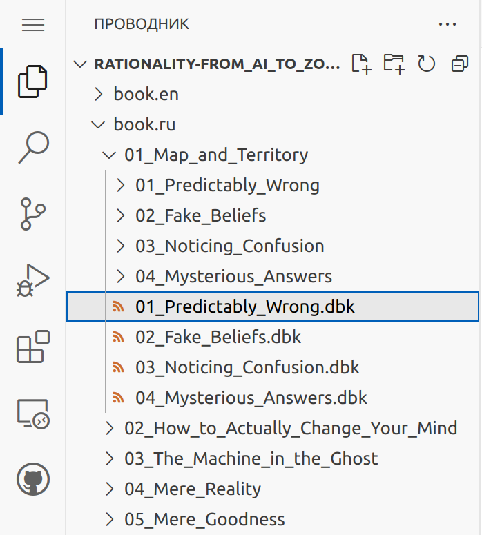
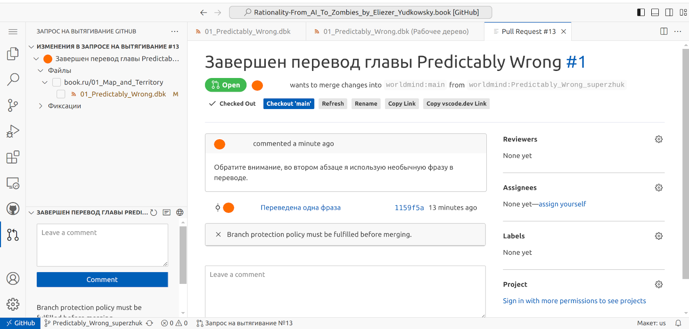
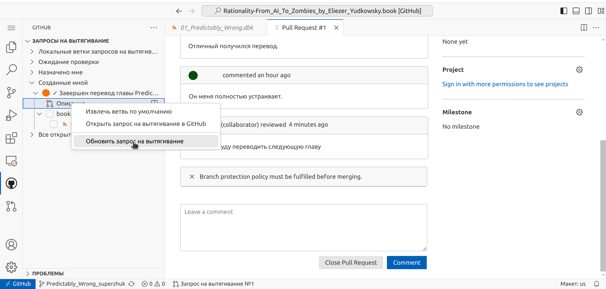
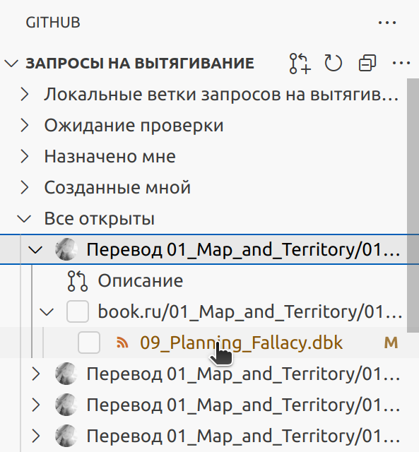
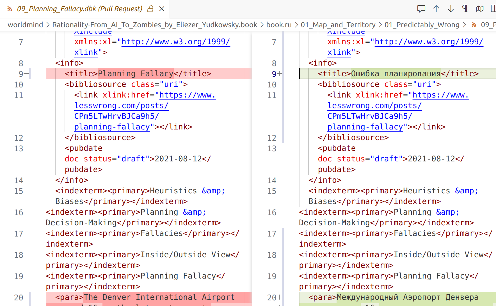

# Краткое руководство для переводчика

В данном руководстве вы найдете пояснения как с помощью веб-редактора найти, отредактировать или сохранить переведенные файлы в репозитории.

1. [Подготовка](#подготовка)
1. [Основные понятия платформы](#основные-понятия-платформы)
1. [Веб-редактор](#веб-редактор)
1. [Выбор файла для перевода](#выбор-файла-для-перевода)
	* [Навигация в Проводнике](#навигация-в-проводнике)
1. [Отдельное рабочее пространство](#отдельное-рабочее-пространство)
	* [Создание новой ветки](#создание-новой-ветки)
	* [Переключение на ветку](#переключение-на-ветку)
1. [Редактирование файла](#редактирование-файла)
1. [Сохранение изменений](#сохранение-изменений)
1. [Отправка изменений в репозиторий](#отправка-изменений-в-репозиторий)
1. [Работа над переводом завершена](#работа-над-переводом-завершена)
1. [Правки после проверки](#правки-после-проверки)
1. [Проверка чужого перевода](#проверка-чужого-перевода)

## Подготовка

Для онлайн работы над файлами вам понадобится аккаунт на `github.com`. Для создания аккаунта перейдите по [ссылке](https://github.com/signup) и далее следуйте инструкциям на экране.

Также для создания веток нужно попросить, чтобы вас добавили в проект. Для этого свяжитесь с владельцем репозитория или [создайте тикет](https://github.com/worldmind/Rationality-From_AI_To_Zombies_by_Eliezer_Yudkowsky.book/issues), нажав зелёную кнопку "New issue". Напишите в заголовке "Добавьте в проект пользователя your_github_user_here" и нажмите "Submit new issue". Когда заявка будет рассмотрена, вам на github придёт приглашение присоединиться к проекту, и надо будет его принять.

## Основные понятия платформы

Платформа GitHub построена поверх открытого инструмента Git и использует определённую терминологию:
- Репозиторий/Repository - хранилище файлов
- Ветка/Branch - копия хранилища для внесения изменений, обычно есть основная ветка (по умолчанию называется main) в которую переносятся изменения из других веток, в которых идёт работат над отдельными задачами.
- Коммит/Commit - набор изменений, сохранённый в один момент времени, т.е. git хранит историю изменений и можно по списку коммитов отследить кто, когда и что изменял.
- Запрос на вытягивание/Pull request - также на некоторых платформах называется запросом на слияние (Merge request), что чуток лучше отражает суть. После создания ветки и внесения изменений т.е. создания одного и более коммитов можно предложить свои изменения для внесения в основную ветку создав этот самый Pull Request
- Ревью кода/Code review - так как git изначально делался для программистов, то некоторые термины про программный код, но на самом деле, конечно, делать ревью изменений можно для чего угодно. Ревью это чтения и оценка изменений другими людьми (хотя перед запросом ревью всегда хорошо сделать саморевью), это один из ключевых механизмов обеспечения качества и согласованности результата проекта.

## Веб-редактор

Для начала работы над переводом, перейдите по [ссылке](https://github.dev/worldmind/Rationality-From_AI_To_Zombies_by_Eliezer_Yudkowsky.book/tree/main/book.ru/).
Если вы еще не авторизованы на `github.com`, вы увидите форму авторизации. Укажите логин, пароль и кликните по кнопке "Sign in".

После этого вы автоматически попадете на страницу веб-редактора и получите доступ к файлам.

## Выбор файла для перевода

Выберите файл для перевода.

Список доступных файлов можно найти в левой боковой панели с заголовком `Проводник`, или `Explorer` (в англоязычном интерфейсе). Панель отображается по клику на иконку  в левом боковом меню.

> [!TIP]
> Левая боковая панель отображается по первому клику на иконку. При повторном нажатии на ту же иконку панель скрывается.

Нужные вам файлы находятся в директории `book.ru` и имеют расширение `dbk`.

### Навигация в Проводнике

+ Увидеть содержимое директории `book.ru` можно, кликнув по символу `>` рядом с ее именем. В `Проводнике`/`Explorer` отобразятся файлы с расширением dbk и поддиректории. Точно так же вы можете раскрыть все вложенные директории и посмотреть список файлов в них.
+ Чтобы свернуть директорию, кликните по символу `v` рядом с ее названием.
+ Для просмотреть содержимого файла, кликните по его имени. В центральном окне редактора появится вкладка с названием файла и его содержимым. Одновременно для просмотра можно открыть несколько файлов, при этом на каждый файл в редакторе появится отдельная вкладка.

## Отдельное рабочее пространство

Создайте для своих изменений отдельное рабочее пространство - `ветку`. Ваш перевод будет хранится в ветке, до момента вливания его в финальную версию `book.ru`. Так что вы сможете многократно и в любой момент вносить правки в файл до того, как сообщите о его готовности владельцу репозитория.

Создайте ветку и переключите веб-редактор на нее.

### Создание новой ветки

Предварительно скопируйте путь к файлу, который планируете переводить - кликнете правой кнопкой по нему в проводнике и выберете "Copy Relative Path", это пригодится при именовании ветки.

На нижней панели редактора найдите иконку  с названием текущей ветки (это должна быть ветка main, если нет, то кликнете и в появившемся меню выберите её) и кликните по ней.

На верхней панели редактора откроется список существующих веток с пунктом `Создать новую ветвь`/`Create new branch`.

Кликните `Создать новую ветвь`/`Create new branch`.

Имя новой ветки соберите из следующих частей:
- немного подправленный относительный путь, скопированный ранее, например, из "book.ru/01_Map_and_Territory/01_Predictably_Wrong/04_The_Martial_Art_of_Rationality.dbk" сделайте "01_Map_and_Territory/01_Predictably_Wrong/04_The_Martial_Art_of_Rationality" убрав "book.ru/" и ".dbk"
- ваш никнейм на `github.com`. Все пробелы в получившейся фразе замените на подчеркивания.

Например, для текста с заголовком `The_Martial_Art_of_Rationality` и никнеймом `superzhuk`, название ветки будет `01_Map_and_Territory/01_Predictably_Wrong/04_The_Martial_Art_of_Rationality_superzhuk`. Впишите название ветки в поле и нажмите enter.

При успешном создании ветки откроется окно с вопросом, нужно ли переключаться на новую ветку.

Кликните по кнопке `Переключиться на ветвь`/`Switch to Branch`. Веб-редактор обновит страницу, и далее на нижней панели будет указана уже ваша рабочая ветка, и внесенные изменения при сохранении будут попадать именно в нее.

Если при создании ветки произошла ошибка, прочитайте сообщение в открывшемся окне. При проблеме на вашей стороне (нет сети, ошибка авторизации и др.), исправьте ее и попробуйте создать ветку снова. Если ошибка непонятна, или возникла на стороне `github.com`, свяжитесь с владельцем репозитория.

### Переключение на ветку

Если вы повторно зашли в веб-редактор и хотите продолжить работу над своим переводом, переключитесь на ранее созданную вами ветку. Для этого на нижней панели редактора кликните на название текущей ветки.

На верхней панели редактора откроется список существующих веток. Найдите в списке название своей ветки и кликните на него.

Веб-редактор обновит страницу и на нижней панели появится название вашей рабочей ветки.

Теперь все файлы, измененные и сохраненные в ветке, снова доступны вам для внесения именений.

## Редактирование файла

Найдите в `Проводнике`/`Explorer` файл, выбранный для перевода. Теперь вы можете открыть его в редакторе и вносить изменения в текст.

> [!IMPORTANT]
> Файл с расширением `dbk` составлен с использованием специальной разметки (DocBook). Поэтому, для сохранения его структуры, не удаляйте и не меняйте текст в угловых скобках `<...>` и текст вида `&...;`. Заменяйте только переводимый текст. 

Когда вы внесете в текст свои правки, в боковом меню на иконке  появится индикатор - число отредактированных файлов. Это напоминание, что нужно сохранить свои изменения, прежде чем вы закроете окно веб-редактора.

## Сохранение изменений

В веб-редакторе вы можете просмотреть сделанные в файлах изменения и принять их для сохранения в репозитории.
Для этого в боковом меню кликните иконку .

После этого в боковой панели появится список изменений, разбитый по файлам.

По умолчанию будут сохранены все изменения, но если хотите сохранить только часть, то добавьте внесенные вами изменения в список для сохранения, кликнув на иконку  рядом с именем файла.

Далее нужно отправить локальные изменения в репозиторий на `github.com`. В поле, над кнопкой `Фиксация и отправка`/`Commit and Push`, кратко опишите, что за изменения вы внесли в текст (например, "Переведено эссе Predictably Wrong", "Исправлена опечатка в тексте" и т.д.), и нажмите кнопку `Фиксация и отправка`/`Commit and Push`.

Теперь ваши правки сохранены на `github.com`.
После этого вы можете продолжать вносить правки в вашей ветке, не забывая периодически отправлять изменения в репозиторий.

## Работа над переводом завершена

Уведомите владельца репозитория о завершении работы над переводом. 

Для этого на боковой панели откройте `Систему управления версиями`/`Source Control`, кликнув на иконку  в боковом меню.

Затем в меню боковой панели кликните на иконку .

Откроется форма со следующими полями:
* в поле `Title` указывается заголовок уведомления. Например, "Перевод 01_Map_and_Territory/01_Predictably_Wrong/04_The_Martial_Art_of_Rationality".
* в поле `Description` вы можете добавить более подробное описание внесенных правок, комментарии к переводу итп. Например, "Обратите внимание, во втором абзаце я использую необычную фразу в переводе...", также можно добавлять комментарии в каждой изменённой строке.

Заполните поля формы и кликните по кнопке "Create".

Уведомление об окончании работы над переводом, с вашими комментариями и связанное с вашей веткой, уйдет владельцу репозитория. Если вы хотите запросить ревью у конкретных участников это можно сделать кликнув на "Reviewers" в правной панели.

Добавьте метку `translation` к уведомлению. Для этого в правой половине окна кликните на строчку `Labels`.

Вверху окна появится список существующих меток. Выберите метку `translation`, поставив галку рядом с ней, и кликните на кнопку `ОК`.

В правой части окна появится добавленная метка.

## Правки после проверки

Владелец репозитория/ревьювер может прокомментировать ваш перевод или попросить вас внести некоторые правки в файл. Его сообщения вы увидите в комментариях к вашему уведомлению.

Для этого кликните на иконку  в боковом меню.

На боковой панели выведется список `Запросов на вытягивание`/`Pull Requests`. Кликните по символу `>` в строчке `Созданные мной`/`Created By Me`.

Вы увидите список ваших уведомлений, отправленных владельцу репозитория. Кликните по символу `>` в строчке одного из уведомлений, затем в развернувшемся списке кликните пункт `Описание`/`Description`.

В центральном окне редактора появится вкладка с вашим уведомлением. В комментариях к нему вы можете увидеть как ваши сообщения, так и сообщения владельца репозитория.

Чтобы отправить сообщение, наберите текст в поле формы и нажмите кнопку "Comment".

Ваше сообщение отправлено.

Чтобы проверить, не появились ли новые сообщения, обновите переписку. Для этого в боковой панели кликните правой кнопкой мыши на строке `Описание`/`Description` и в появившемся меню выберите пункт `Обновить запрос на вытягивание`/`Refresh Pull Request`.

Страница с перепиской обновится.

Если после всех обсуждений вы внесли правки в перевод, снова [отправьте изменения в репозиторий](#отправка-изменений-в-репозиторий). Когда Pull request будет принят в основную ветку, его статус с Open смениться на Merged.

## Проверка чужого перевода

Чтобы начать проверку/ревью чужого перевода, откройте на боковой панели список `Запросов на вытягивание/Pull Requests` (детали смотрите в разделе [Правки после проверки](#правки-после-проверки)).

Если на вас назначили ревью, вы найдете его в разделе `Ожидание проверки/Waiting For My Review`. Если вы сами хотите выбрать перевод для проверки, откройте раздел `Все открыты/All Open` со всеми открытыми уведомлениями.

Разверните выбранное вами уведомление и кликните на строке с названием файла.

В центральном окне редактора откроется вкладка, в которой можно увидеть все изменения по отношению к англоязычному исходнику. Красным подсвечен исходный текст строки, зеленым - измененный.

Наведите курсор мышки на строку, которую хотите прокомментировать, и кликните появившуюся кнопку `+`.

В открывшемся окне напишите свой комментарий.
* Если это первый комментарий в ревью, отправьте его, кликнув кнопку `Начать проверку/Start review`.
* Если вы уже начали ревью и отправляли комментарии к переводу, кликните кнопку `Добавить комментарий к проверке/Add Review Comment`.
* Если вы хотите прокомментировать перевод и на этом завершить ревью, кликните кнопку `Добавить комментарий/Add Comment`.

Ваш комментарий появится в переписке на странице уведомления.

> [!TIP]
> Если вы хотите оставить комментарий ко всему файлу, без указания конкретной строки, кликните на иконку  в верхнем меню и далее оставляйте комментарии, как описано выше.

После того как вы проверили измененные файлы, завершите ваше ревью. Для этого откройте переписку на странице уведомления и оставьте там общий для вашего ревью комментарий, кликнув на кнопку `Submit Review`.

**Спасибо за вашу работу!**
