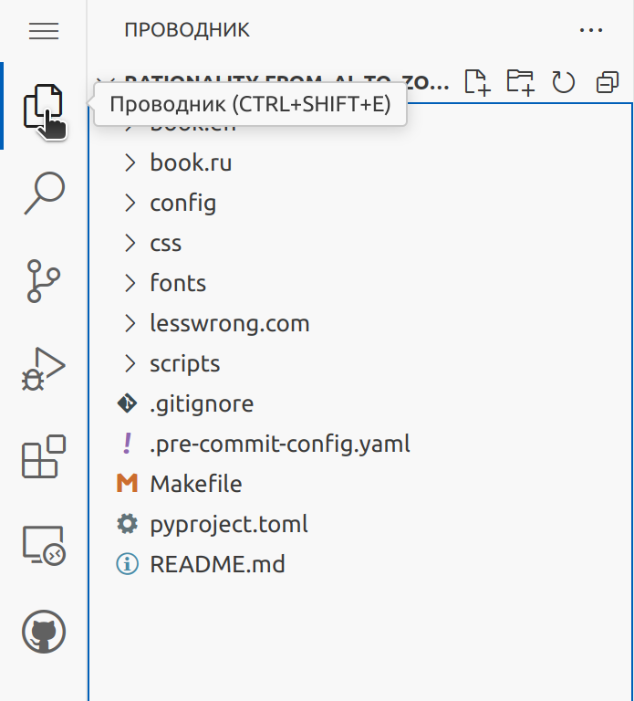
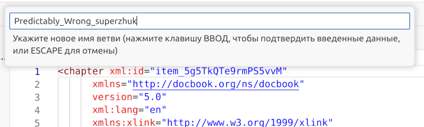
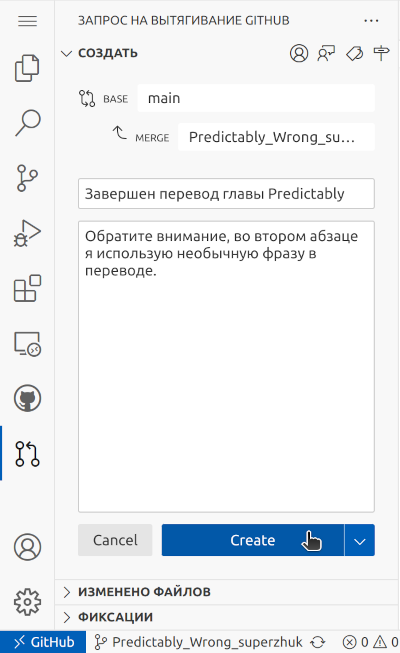

# Краткое руководство для переводчика
В данном руководстве вы найдете пояснения как с помощью веб-редактора найти, отредактировать или сохранить переведенные файлы в общем хранилище.

## Подготовка
Для онлайн работы над файлами вам понадобится аккаунт на `github.com`. Для создания аккаунта, перейдите по [ссылке](https://github.com/signup) и далее следуйте инструкциям на экране.

## Веб-редактор
Для начала работы над переводом, перейдите по [ссылке](https://github.dev/worldmind/Rationality-From_AI_To_Zombies_by_Eliezer_Yudkowsky.book/tree/main/book.ru/).
Если вы еще не авторизованы на `github.com`, вы увидите форму авторизации. Укажите логин, пароль и кликните кнопку "Sign in".

После этого вы автоматически попадете на страницу веб-редактора и получите доступ к файлам.

## Выбор файла для перевода
Выберите файл для перевода.

Список доступных файлов можно найти в левой боковой панели с заголовком `Проводник`.

`Проводник` отображается по клику на иконку в левом боковом меню

> [!TIP]
> Левая боковая панель отображается по первому клику на иконку. При повторном нажатии на ту же иконку, панель скрывается.

Нужные вам файлы находятся в директории `book.ru` и имеют расширение `dbk`.

### Навигация в Проводнике
+ Увидеть содержимое директории `book.ru` можно, кликнув по символу `>` рядом с ее именем. В проводнике отобразятся файлы с расширением dbk и поддиректории. Точно так же вы можете раскрыть все вложенные директории и посмотреть список файлов в них.
+ Чтобы свернуть директорию, кликните по символу `v` рядом с ее названием.
+ Для просмотреть содержимого файла, кликните по его имени. В центральном окне редактора появится вкладка с названием файла и его содержимым. Одновременно для просмотра можно открыть несколько файлов, при этом на каждый файл в редакторе появится отдельная вкладка.

## Отдельное рабочее пространство
Создайте для своих изменений отдельное рабочее пространство - `ветку`.
Ваш перевод будет хранится в ветке, до момента вливания его в финальную версию `book.ru`. Так что вы сможете многократно и в любой момент вносить правки в файл до того, как сообщите о его готовности владельцу хранилища. Для этого нужно создать ветку и переключить свой веб-редактор на нее.

### Создание новой ветки
На нижней панели редактора кликните на название текущей ветки.

На верхней панели редактора откроется список существующих веток с дополнительным пунктом `Создать новую ветвь`.

Кликните `Создать новую ветвь`.
Имя новой ветки соберите из следующих частей: английский заголовок переводимого текста и ваш никнейм на `github.com`. Все пробелы в получившейся фразе замените на подчеркивания.
Например, для текста с заголовком `Predictably Wrong` и никнеймом-ом `superzhuk`, название ветки будет `Predictably_Wrong_superzhuk`. Впишите название ветки в поле и нажмите enter.

При успешном создании ветки откроется окно с информационным сообщением и вопросом, нужно ли переключаться на новую ветку.

Кликните по кнопке `Переключиться на ветвь`. Веб-редактор обновит страницу и далее на нижней панели будет указана уже ваша рабочая ветка, и внесенные изменения при сохранении будут попадать именно в нее.

Если при создании ветки произошла ошибка, прочитайте сообщение в открывшемся окне. При проблеме на вашей стороне (нет сети, ошибка авторизации и др.), исправьте ее и попробуйте создать ветку снова. Если ошибка непонятна, или возникла на стороне `github.com`, [свяжитесь](ССЫЛКА ДЛЯ СВЯЗИ) с владельцем хранилища.

### Переключение на ветку
Если вы повторно зашли в веб-редактор и хотите продолжить работу над своим переводом, переключитесь на ранее созданную вами ветку. Для этого на нижней панели редактора кликните на название текущей ветки.

На верхней панели редактора откроется список существующих веток. Найдите в списке название своей ветки и кликните на него.

Веб-редактор обновит страницу и на нижней панели появится название вашей рабочей ветки.

Теперь все файлы, измененные и сохраненные в ветке, снова доступны вам для внесения именений.

## Редактирование файла
Найдите в `Проводнике` файл, выбранный для перевода. Теперь вы можете открыть его в редакторе и вносить изменения в текст.

> [!IMPORTANT]
> Файл с расширением `dbk` составлен с использованием специальной разметки. Поэтому, для сохранения его структуры, не удаляйте и не меняйте текст в угловых скобках `<...>` и текст вида `&...;`. Заменяйте только переводимый текст. 

Когда вы внесете в текст файла свои правки, в левом боковом меню на иконке `Система управления версиями` появится индикатор - число отредактированных файлов. Это напоминание, что нужно сохранить (или отменить) свои изменения, прежде чем вы закроете окно веб-редактора.

## Сохранение изменений
В веб-редакторе вы можете просмотреть сделанные в файлах изменения, принять их для сохранения или отменить, с возвращением файла в исходное состояние.
Для этого в левом боковом меню кликните иконку `Система управления версиями`.

После этого в левой боковой панели появится список изменений, разбитый по файлам.

Рядом с именем каждого файла есть иконки:
-  - отменяет внесенные в файл изменения, текст возвращается в состояние до внесения правок;
-  - добавляет внесенные изменения в список того, что будет сохранено;
-  - убирает ранее добавленные изменения из списка сохраняемых, но не отменяет их в файле. Позже вы можете снова добавить их в список для сохранения через иконку "плюс";
-  - выводит в окне редактора, в двух вкладках старое и новое содержимое файла. Красным подсвечивается старое содержимое абзаца, зеленым - новое. Так вы можете увидеть внесенные вами изменения.

Примените или сбросьте внесенные вами изменения.

## Отправка изменений в хранилище
Далее нужно отправить локальные изменения в хранилище на `github.com`. В поле, над кнопкой `Фиксация и отправка`, кратко опишите, что за изменения вы внесли в текст (например, "Исправлена опечатка в тексте"), и нажмите кнопку `Фиксация и отправка`.

Теперь ваши правки сохранены на `github.com` и доступны для просмотра владельцу хранилища.
После этого вы можете продолжать вносить правки в вашей ветке, не забывая периодически отправлять изменения в хранилище.

## Работа над переводом завершена
Уведомите владельца хранилища о завершении работы над переводом. Для этого в левой боковой панели откройте `Систему управление версиями`.

Затем в левой боковой панели кликните на иконку `Создать запрос на вытягивание`.

Откроется окно с двумя полями для заполнения:
* в поле `Title` указывается заголовок уведомления. Например, "Завершен перевод главы Predictably Wrong".
* в поле `Description` вы можете добавить более подробное описание внесенных правок, комментарии к переводу итп. Например, "Обратите внимание, во втором абзаце я использую необычную фразу в переводе...".

Заполните поля формы и кликните по кнопке "Create".

Уведомление об окончании работы над переводом, с вашими комментариями и связанное с вашей веткой, уйдет владельцу хранилища.

**Спасибо за вашу работу!**
